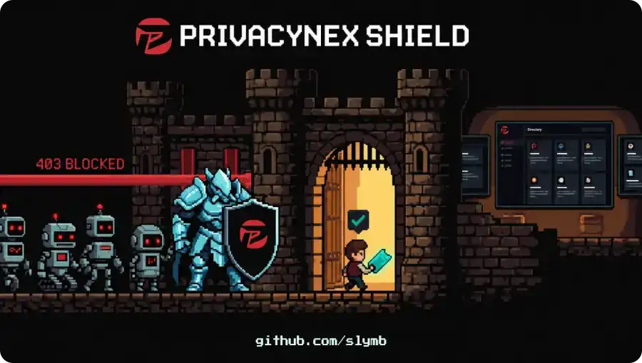
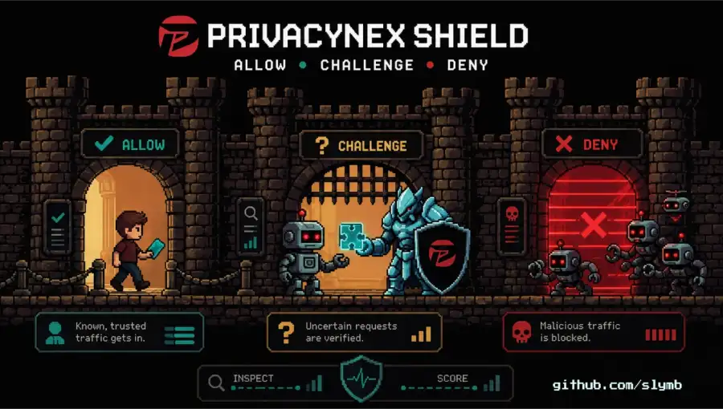
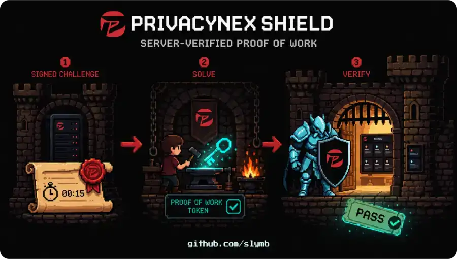

# Privacynex Shield

[](https://github.com/privacynex/privacynex-shield/actions/workflows/ci.yml)
[](https://www.npmjs.com/package/privacynex-shield)
[](https://www.typescriptlang.org/)
[](LICENSE)
[](package.json)
[](https://deepwiki.com/privacynex/privacynex-shield)

---

<p align="center">
  
</p>

---

[Version française](README.fr.md) | [Production deployment](DEPLOYMENT.md) | [Security](SECURITY.md) | [Contributing](CONTRIBUTING.md) | [Versioning](VERSIONING.md)

Privacynex Shield is a server-verified proof-of-work gate built on the Fetch API. The provided scaffold targets Cloudflare Pages, while the core middleware can be wired into other Fetch-compatible runtimes after platform-specific validation. It combines short-lived signed challenges, server-side PoW verification, HMAC clearance cookies and network-verified crawler bypasses.

This public version is derived from the Shield used by [Privacynex](https://privacynex.org).

License: Apache-2.0. Runtime dependencies: none.

## Security model

The following invariants are deliberately not configurable from browser JavaScript:

- a clearance cookie is issued only after a valid server-signed challenge;
- the submitted nonce must remain inside the signed range;
- tokens and cookies are authenticated with HMAC-SHA-256;
- challenges and cookies are bound to the request hostname and a coarse client network prefix;
- every valid challenge can be consumed once per server instance before a cookie is issued;
- production cookies use `__Host-`, `Secure`, `HttpOnly`, `SameSite=Lax` and `Path=/`;
- API calls are same-origin and reject browser navigation contexts;
- a crawler User-Agent never grants access without a matching official IP range;
- crawler bypasses are restricted to their intended public content paths;
- request bodies, token sizes, PoW limits and rate-limit state are bounded.

Brand name, language, same-origin asset paths and display delays are customizable. They do not change access decisions.

Privacynex Shield raises the cost of automated access. It does not replace your platform's DDoS protection or WAF rules, and it complements them as an application-layer check in front of the pages and API routes you choose to protect.

## What gets blocked

Every request ends in one of three outcomes: **deny** (403, no challenge offered), **challenge** (proof of work before any content is served), or **allow**.

<p align="center">
  
</p>

```text
Request
  │
  ├─→ SHIELD_ENABLED=false ..................... pass through, no checks
  ├─→ SHIELD_SECRET missing .................... 503, fail closed
  ├─→ /robots.txt /sitemap.xml /.well-known/* .. serve
  ├─→ AI crawler or scripted client UA ......... 403
  │
  ├─→ /api/*  ─→ over rate limit ............... 403
  │             └→ otherwise ................... serve
  │
  └─→ GET document
        │
        │   origin response is fetched here, then inspected
        │
        ├─→ response is not HTML ............... serve as is
        ├─→ over rate limit .................... 403
        ├─→ sensitive path or deny signal ...... 403
        ├─→ verified crawler IP range .......... serve
        ├─→ valid clearance cookie ............. serve
        └─→ otherwise .......................... challenge page
```

The origin is called before the gating decision so that Shield can read the response `Content-Type`. An asset-looking URL that actually returns HTML stays protected, and a real static asset is served untouched. The origin response is never returned to a visitor who has not cleared the gate.

Clearing the gate looks like this:

```text
Challenge page
  │
  ├─→ browser solves a SHA-256 proof of work in a Web Worker
  ├─→ POST /api/shield-verify { challengeToken, nonce }
  │      ├─→ server recomputes the proof ....... invalid → 403
  │      ├─→ nonce outside the signed range .... 403
  │      ├─→ challenge already consumed ........ replay  → 403
  │      └─→ HMAC clearance cookie issued (24 h)
  │
  └─→ page reloads, cookie verified, content served
```

<p align="center">
  
</p>

### Denied outright

**Declared AI training and scraping crawlers**, matched on User-Agent:

```text
GPTBot, ClaudeBot, CCBot, Bytespider, Google-Extended, Applebot-Extended,
Meta-ExternalAgent, meta-externalfetcher, PetalBot, Amazonbot, cohere-ai,
DeepSeekBot, Diffbot
```

For these declared crawler patterns, the User-Agent match enforces an opt-out policy; it is not an identity check. Automated clients using a different identity are handled by scoring and proof of work instead.

**Scripted HTTP clients and security scanners**, matched on User-Agent:

```text
python-requests, python-urllib, aiohttp, httpx, curl, wget, libcurl,
Go-http-client, Apache-HttpClient, node-fetch, axios, got, Scrapy, colly,
scraperapi, HeadlessChrome, PhantomJS, Censys, Shodan, sqlmap, nikto
```

**Probes for sensitive paths**, whatever the User-Agent:

```text
/.env  /.git  /.aws  /.ssh  /.netrc  /.npmrc  /wp-config  /wp-admin
/wp-login  /xmlrpc  /phpmyadmin  /server-status
```

Path denial applies in every decision mode, including the default `legacy`.

### Challenged

Proof-of-work difficulty scales with the request score. In the default `legacy` mode: score below 15 gets the easy challenge (~500 ms), below 35 the normal one (~1-2 s), and 35 or above the hard one (~4-8 s).

Browser automation fingerprints (Playwright, Puppeteer, Selenium, WebDriver, PhantomJS and DevTools automation) and admin-looking document paths such as `/admin` force the hard challenge when `SHIELD_DECISION_MODE=multi` is enabled. Application API routes remain the application's responsibility.

### Scoring signals

Weights are cumulative. Negative weights are trust boosts.

| Signal | Weight |
|---|---:|
| Known bot User-Agent | +100 |
| Obsolete TLS 1.0 / 1.1 | +25 |
| Cloud or datacenter ASN, on a document path only | +20 |
| Modern Chrome User-Agent without `Sec-CH-UA` | +20 |
| Tor exit node | +20 |
| Missing `Sec-Fetch-Dest` on HTTP/2+ | +15 |
| Missing `Accept-Language` | +10 |
| Suspect referer (translation and cache proxies) | +10 |
| TCP round trip above 500 ms | +5 |
| Residential ASN on HTTP/2+ | -5 |
| iCloud Private Relay | -10 |

Signals sourced from `request.cf` (ASN, country, TLS version, HTTP protocol, RTT) are Cloudflare-specific. On other platforms those rows simply never fire, and detection falls back to the header and path signals.

Rate limits, in memory and per server instance: 30 HTML requests per minute per IP, 120 API requests per minute per IP, 10 proof-of-work submissions per minute per IP.

### Allowed without a challenge on eligible paths

Verified search and AI crawlers whose IP matches their operator's official published ranges can bypass the challenge on their permitted paths (see [Verified crawlers](#verified-crawlers)). The following infrastructure paths also remain reachable:

```text
/robots.txt  /favicon.ico  /favicon.png  /sitemap.xml
/.well-known/security.txt  /.well-known/gpc.json  /cdn-cgi/*
```

## Tuning the ASN list

`BAD_ASNS_PUBLIC` in `src/config/defaults.ts` ships a deliberately small, generic starter set: widely abused hyperscalers (AWS, Google Cloud, DigitalOcean, Hetzner, OVH, Akamai/Linode, Alibaba, Tencent, Contabo) and one documented scanner network (Censys). It is a starting point, not a reputation service.

Matching one of these ASNs adds 20 points on a document request and does not trigger a denial by itself. Other request signals can still affect the final decision.

Add your own ASNs with the `BAD_ASNS_EXTRA` environment variable, comma-separated:

```bash
BAD_ASNS_EXTRA=64496,64497,64498
```

Keeping a custom list in an environment variable avoids maintaining a source-code fork for deployment-specific configuration.

### Where to source ASN and IP lists

The projects below are commonly used references, listed for convenience and not endorsed or audited by this project. Review each one's licence and suitability yourself before adopting it: terms differ, and some restrict commercial use.

**Directly usable in `BAD_ASNS_EXTRA`** (they publish AS numbers):

- [Spamhaus Do Not Route or Peer](https://www.spamhaus.org/blocklists/do-not-route-or-peer/) (formerly ASN-DROP): autonomous systems Spamhaus associates with criminal activity.

**Not usable in `BAD_ASNS_EXTRA`** (they publish IP addresses and CIDR ranges, not AS numbers). Apply these at your WAF, firewall or edge network, upstream of Shield:

- [FireHOL blocklist-ipsets](https://github.com/firehol/blocklist-ipsets): aggregated IP blocklists.
- [IPsum](https://github.com/stamparm/ipsum): daily list of addresses reported as malicious.
- [X4BNet lists_vpn](https://github.com/X4BNet/lists_vpn): datacenter and VPN ranges.
- [AbuseIPDB](https://www.abuseipdb.com/): reputation API with a free tier.

To look up which ASN an address belongs to, [bgp.he.net](https://bgp.he.net) and [bgp.tools](https://bgp.tools) are the usual tools.

### Avoiding false positives

Use `SHIELD_DECISION_MODE=shadow` before `multi`. It preserves legacy enforcement while calculating the multi-level decision, but the package does not persist shadow telemetry by itself. Add observation in the surrounding application if you need a rollout comparison. Test `SHIELD_COHERENCE_ENABLED=1` separately: it changes the score and can increase PoW difficulty outside `multi`.

Two known biases worth reviewing for your own audience:

- the residential trust boost lists mostly French, German and United States consumer ISPs, so visitors on other networks get no boost;
- blocking a whole hyperscaler ASN also affects legitimate traffic that transits it, corporate VPNs and privacy proxies in particular.

## Install

```bash
npm install privacynex-shield
npx privacynex-shield init --functions functions --public public
```

For a static project whose publish directory is the project root:

```bash
npx privacynex-shield init --functions functions --public .
```

The installed command is also available as `pnx-shield`.

The initializer creates:

```text
functions/_middleware.ts
functions/api/shield-challenge.ts
functions/api/shield-verify.ts
public/pnx-shield/shield.js
public/pnx-shield/pow-worker.js
```

It refuses to overwrite existing files. If your project already has a middleware or either API route, merge the handlers manually and keep the same security checks.

This scaffold targets Cloudflare Pages Functions directly. For another Fetch-compatible runtime, see [Other runtimes](#other-runtimes) below and validate the platform adapter before production.

Before production, follow the complete [production deployment checklist](DEPLOYMENT.md). In particular, Shield does not authenticate application APIs: requests under `/api/*` still require their own authentication and authorization.

## Configure

Generate a 256-bit secret:

```bash
openssl rand -hex 32
```

Store it as `SHIELD_SECRET` in your platform's secret manager. Never place it in a client variable, repository, config file or `.env` committed to Git.

Optional environment variables:

| Variable | Default | Purpose |
|---|---:|---|
| `SHIELD_ENABLED` | `true` | Set to `false` for an emergency bypass |
| `SHIELD_POLICY_VERSION` | `v1` | Change to invalidate all live challenges and cookies |
| `SHIELD_DECISION_MODE` | `legacy` | `legacy`, compatibility `shadow`, or enforced `multi` |
| `SHIELD_COHERENCE_ENABLED` | unset | Set to `1` only after representative traffic tests |
| `SHIELD_CLIENT_IP_HEADER` | `CF-Connecting-IP` | Request header carrying the authoritative client IP on your platform |
| `BAD_ASNS_EXTRA` | unset | Additional numeric ASNs, comma-separated |
| `SHIELD_BRAND_NAME` | `Protected site` | Challenge page brand, maximum 80 characters |
| `SHIELD_LANGUAGE` | `en` | `fr`, `en`, `es` or `de` |
| `SHIELD_LOGO_PATH` | unset | Same-origin image path |
| `SHIELD_CLIENT_PATH` | `/pnx-shield/shield.js` | Same-origin client script path |
| `SHIELD_WORKER_PATH` | `/pnx-shield/pow-worker.js` | Same-origin worker path |

`SHIELD_CLIENT_IP_HEADER` matters outside Cloudflare: set it to the header your edge network or reverse proxy sets for the real client IP (for example `True-Client-IP` or a header set by your own trusted proxy). Only trust a header that your infrastructure sets or overwrites itself; never point it at a header a client could set directly.

Rate limiting and replay protection are in-memory and scoped to the running server instance. That is enough for a single edge isolate or a small fleet behind sticky routing; a request replayed against a different instance is not caught. This keeps the package dependency-free and portable; operators who need cross-instance coordination can add their own shared store in front of `checkRateLimit` / `markSpentOrReject`.

Use test secrets in your local dev server before any production activation.

### Replay the local example

The example page includes a **Run Shield again** button. Its reset handler is
stored under `example/functions/`, accepts only same-origin `POST` requests on
loopback hosts and is never copied by the package initializer. Keep this demo
handler out of production deployments.

## Other runtimes

`shieldFetch(request, env, next)` is the actual gate: a plain function over the Fetch API's `Request`/`Response`, with no Cloudflare Pages dependency. `next` returns the response your app would normally serve; Shield decides whether to return it as-is, gate it behind a challenge, or block it.

```ts
import { shieldFetch } from 'privacynex-shield/middleware';

// Example adapter for a server runtime built on the Fetch API
export default {
  fetch(request: Request, env: Env) {
    return shieldFetch(request, env, () => myApp.handle(request));
  },
};
```

Cloudflare Pages Functions gets a ready-made `onRequest` wrapper around the same function (see `functions/_middleware.ts` from the initializer). The packaged scaffold and release checks cover Cloudflare Pages/workerd, and the server exports are checked on Node 22 and 24. Cloudflare Workers, Deno, Bun and Vercel Edge Functions remain integration targets rather than platforms covered by the current automated matrix.

Signals sourced from `request.cf` (ASN, country, TLS version, HTTP protocol) are Cloudflare-specific and are skipped when that metadata is unavailable. On another platform, validate the routing, authoritative client-IP header and failure behaviour in staging before production.

## Browser customization

When you provide your own challenge document, presentation settings can be set before loading the client:

```html
<script>
  window.PNX_SHIELD = {
    brandName: 'Example',
    logoDark: '/assets/logo-dark.svg',
    logoLight: '/assets/logo-light.svg',
    overlayDelayEasy: 1200,
    texts: {
      en: { title: 'Security check' },
      fr: { title: 'Vérification de sécurité' }
    }
  };
</script>
<script src="/pnx-shield/shield.js" defer></script>
```

All paths are restricted to the current origin. Text is rendered with DOM text nodes, not `innerHTML`.

## Verified crawlers

Googlebot, Bingbot and selected user-triggered AI/search fetchers can bypass the HTML challenge only when both conditions match:

1. the expected User-Agent;
2. an address in the operator's official published IP ranges.

The embedded snapshot is refreshed with:

```bash
npm run refresh:crawlers
```

Review and commit the generated snapshot. The runtime performs no network lookup and fails closed when no official range matches.
The refresh command rejects invalid, excessively broad, oversized or cross-origin redirected source data.

## Development

```bash
npm install
npm run check
npm pack --dry-run
```

`npm run check` executes strict TypeScript validation, security regression tests and distribution consistency checks. The CI badge above reflects this exact command, run on Node 22 and 24.

### What the tests cover

The suite in `test/` encodes the security invariants listed under [Security model](#security-model). Each one is a regression guard: if a change breaks the invariant, the test fails.

**Cryptographic integrity**
- signed challenges and cookies reject tampering and a changed hostname;
- the verify endpoint never accepts an unsigned salt and target as a fallback;
- only server-signed clearance cookies are ever issued;
- a consumed challenge cannot be replayed, from any client IP.

**Access control**
- a missing clearance returns a hardened challenge document, never the origin content;
- sensitive paths are denied in every decision mode;
- a bot User-Agent alone never obtains protected content;
- an asset-looking URL that returns HTML stays protected;
- a genuine static asset is still served without clearance.

**Crawler verification**
- a spoofed crawler User-Agent never bypasses the gate;
- a bypass requires both the expected User-Agent and an address in the operator's official range;
- the crawler-bypass helper never authorizes sensitive or admin paths.

**Input and resource limits**
- the JSON reader rejects an oversized streamed body sent without `Content-Length`;
- the verify endpoint rejects cross-origin requests;
- rate-limit state never exceeds its hard capacity.

**Client and tooling**
- the browser client contains no HTML string injection sink (`innerHTML`, `insertAdjacentHTML`, `document.write`);
- the initializer refuses to write through a symbolic link;
- the local demo reset stays confined to loopback hosts and same-origin `POST`.

These tests are regression guards for known invariants. They raise the cost of introducing a regression, and they are not a proof that the code is free of vulnerabilities. Independent review is welcome: see [CONTRIBUTING.md](CONTRIBUTING.md) to propose a test, and [SECURITY.md](SECURITY.md) to report a suspected vulnerability privately.

The repository includes a live HTML example in `example/index.html`. When the
repository root is served over HTTP, the page reads the package name, version,
author and license directly from `package.json`.

Maintainers must follow [VERSIONING.md](VERSIONING.md).

## Responsible disclosure

Do not open a public issue for a suspected vulnerability. Follow [SECURITY.md](SECURITY.md).

## Support the project

If Privacynex Shield is useful to you, you can support its maintenance:

[](https://github.com/sponsors/slymb)
[](https://buymeacoffee.com/slym)

## Credits and license

Privacynex Shield is created by Slym B., published by Privacynex and released under
the [Apache License 2.0](LICENSE).

The Privacynex names, trademarks, logos and visual identity are not licensed
under the Apache License. See [TRADEMARKS.md](TRADEMARKS.md).
